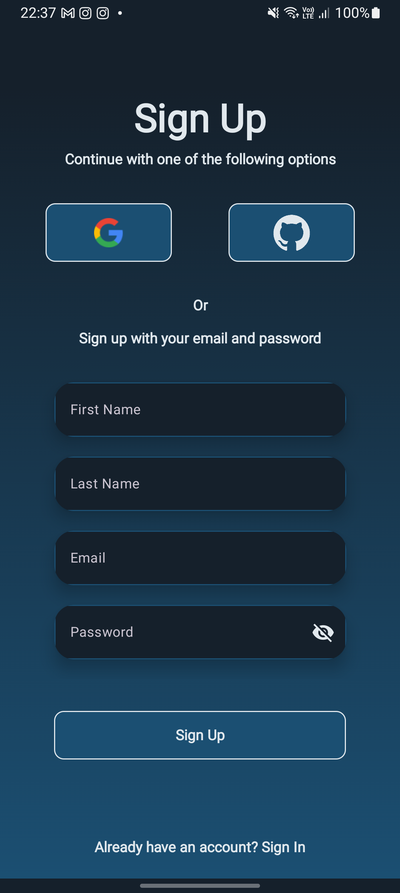
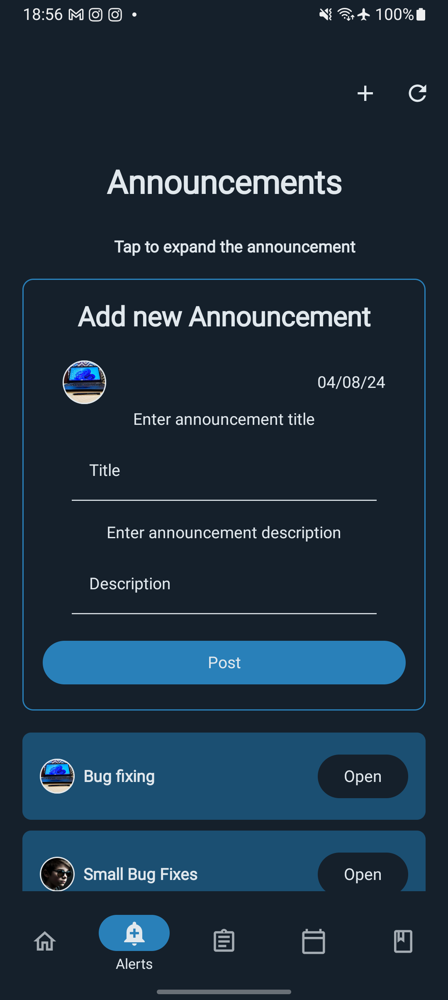
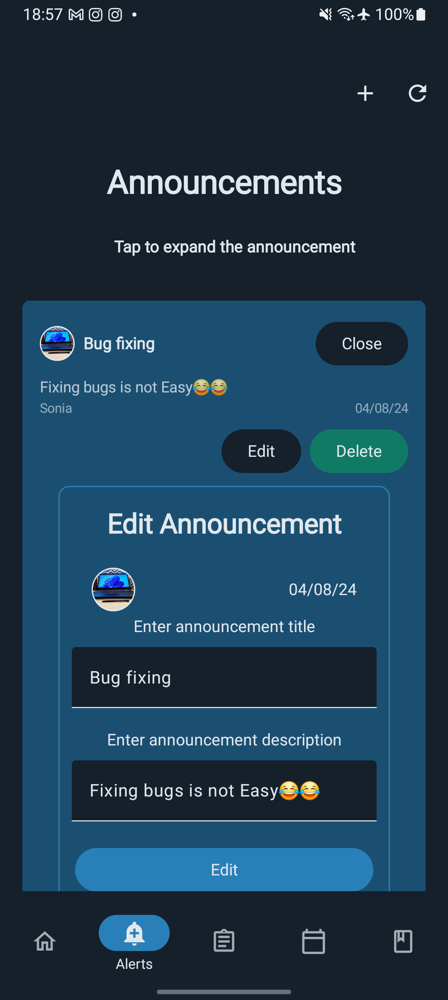

## UNI ADMIN Documentation

### Table of Contents

- [Authentication](#authentication)
    - [Overview](#overview)
    - [Google Authentication](#google-authentication)
    - [GitHub Authentication](#github-authentication)
    - [Authentication Screen](#authentication-screen)
    - [MoreDetails Composable](#moreDetails-composable)
    - [Password Reset](#password-reset)
- [Visuals](#visuals)

## Authentication

### Overview
This section provides a detailed overview of the components and functionality related to user authentication within Uni Admin. It covers different authentication methods, including email/password login, third-party authentication using Google and GitHub, and password reset functionality. The documentation outlines the UI components, state management, and backend logic involved in each authentication process. It also includes references to relevant code files and visual representations of the user interface.

### Google Authentication

**File**: [GoogleAuth.kt](app/src/main/java/com/mike/uniadmin/authentication/GoogleAuth.kt)

**Functionality**

The `GoogleAuth` composable function handles Google authentication using [Firebase](https://firebase.google.com/docs/auth). It initiates the Google sign-in process and provides visual feedback to the user.

**Parameters**

- `firebaseAuth`: An instance of `FirebaseAuth` used to initiate the Google sign-in process.
- `onSignInSuccess`: A callback function triggered when the sign-in process is successful.
- `onSignInFailure`: A callback function triggered when the sign-in process fails, passing an error message.

**Behavior**

1. When the box is clicked, the function starts the Google sign-in process using Firebase Authentication.
2. While the sign-in process is ongoing, a circular progress indicator is displayed.
3. If the sign-in is successful, a check icon is displayed and `onSignInSuccess` is called.
4. If the sign-in fails, an error message is displayed and `onSignInFailure` is called.

### GitHub Authentication

**File**: [GithubAuth.kt](app/src/main/java/com/mike/uniadmin/authentication/GithubAuth.kt)

**Functionality**

The `GitAuth` composable function handles GitHub authentication using [Firebase](https://firebase.google.com/docs/auth). It initiates the GitHub sign-in process and provides visual feedback to the user.

**Parameters**

- `firebaseAuth`: An instance of `FirebaseAuth` used to initiate the GitHub sign-in process.
- `onSignInSuccess`: A callback function triggered when the sign-in process is successful.
- `onSignInFailure`: A callback function triggered when the sign-in process fails, passing an error message.

**Behavior**

1. When the box is clicked, the function starts the GitHub sign-in process using Firebase Authentication.
2. While the sign-in process is ongoing, a circular progress indicator is displayed.
3. If the sign-in is successful, a check icon is displayed and `onSignInSuccess` is called.
4. If the sign-in fails, an error message is displayed and `onSignInFailure` is called.

## Authentication Screen

**File**: [Login.kt](app/src/main/java/com/mike/uniadmin/authentication/Login.kt)

### Initialization

- **Firebase Authentication Instance:**
    - `val auth: FirebaseAuth = FirebaseAuth.getInstance()`: Initializes a `FirebaseAuth` instance.
- **State Variables:**
    - `firstName`, `lastName`, `email`, `password`: Holds user input values.
    - `isSigningUp`: Boolean to toggle between Sign Up and Sign In modes.
    - `isGithubLoading`, `isGoogleLoading`: Boolean flags for loading states during GitHub and Google sign-in.
    - `visible`: Controls visibility, initially set to true.
    - `loading`: Manages the loading state during form submission.
- **Repositories and ViewModels:**
    - Retrieves [notificationRepository](app/src/main/java/com/mike/uniadmin/dataModel/notifications/NotificationRepository.kt) and [userRepository](app/src/main/java/com/mike/uniadmin/dataModel/users/UserRepository.kt) from the application context.
    - Initializes [NotificationViewModel](app/src/main/java/com/mike/uniadmin/dataModel/notifications/NotificationsViewModel.kt) and [UserViewModel](app/src/main/java/com/mike/uniadmin/dataModel/users/UserViewModel.kt) using the respective repositories.

### UI Components

- **Top Bar:**
    - An empty top bar with the primary color.
- **Main Column:**
    - A vertical arrangement with text fields for user input and buttons for authentication options.
    - Displays "Sign In" or "Sign Up" text based on the `isSigningUp` state.
- **Third-Party Sign-In:**
    - `GoogleAuth` and `GitAuth` components handle third-party authentication.
    - On success, `handleAuthSuccess` is called.
    - On failure, a Toast message is displayed.
- **Email and Password Authentication:**
    - Text fields for email and password inputs.
    - If `isSigningUp` is true, additional fields for first and last name are shown.
    - A button to trigger `handleSignUp` or `handleSignIn` based on the `isSigningUp` state.
- **Password Reset:**
    - A link to navigate to the password reset screen when not in sign-up mode.
- **Toggle Sign Up/Sign In:**
    - A button to switch between Sign Up and Sign In modes with animated content transitions.

### Authentication Handlers

- **`handleAuthSuccess`:**
    - Called after successful third-party authentication.
    - Fetches user by email and navigates to the appropriate screen (`homeScreen` or `moreDetails`).
- **`handleSignUp`:**
    - Validates email and password fields.
    - Registers the user with Firebase Authentication.
    - Creates a new [UserEntity](app/src/main/java/com/mike/uniadmin/dataModel/users/UserEntity.kt) and writes it to the `UserViewModel`.
    - Generates a notification indicating the new user has joined.
    - Displays appropriate Toast messages based on success or failure.
- **`handleSignIn`:**
    - Validates email and password fields.
    - Signs in the user with Firebase Authentication.
    - Fetches user details and navigates to the home screen.
    - Fetches the Firebase Cloud Messaging token and writes it to the database.
    - Displays appropriate Toast messages based on success or failure.

### LaunchedEffect

- Fetches the current user's email and retrieves user details when the composable is first composed.

This structure ensures the screen dynamically handles both sign-in and sign-up processes, manages third-party authentication, and updates the user interface accordingly based on user interactions and authentication states.

## MoreDetails Composable

**File**: [MoreDetails.kt](app/src/main/java/com/mike/uniadmin/authentication/ExtraDetails.kt)

### Description

The `MoreDetails` composable function displays a form for users to enter additional details like their first and last names after signing in. It also allows saving these details to the local database and notifies other users about the new user joining.

### Parameters

- `context`: `Context`: The context of the calling component.
- `navController`: `NavController`: The navigation controller to handle navigation between different screens.

### Functionality

- **Initialization:**
    - Retrieves the `UserRepository` and `NotificationRepository` from the `UniAdmin` application context.
    - Initializes the `UserViewModel` and `NotificationViewModel` using the repositories.
- **State Management:**
    - Uses `remember` and `mutableStateOf` to manage state variables for loading status (`addloading`), first name, and last name.
    - Retrieves the currently logged-in user from Firebase Authentication.
- **UI Layout:**
    - Applies a vertical gradient background using `Brush.verticalGradient`.
    - Displays a `TopAppBar` with a back navigation button.
    - Shows a title "Details" at the top.
    - Contains two text fields for the first and last names.
    - Provides a button to save the details.
- **Saving Details:**
    - On button click, generates a user ID and creates a `UserEntity` with the entered details.
    - Saves the user entity to the database using `UserViewModel`.
    - Generates a notification ID and writes a welcome notification using `NotificationViewModel`.
    - Navigates to the home screen upon successful saving of details.

### Important Notes

- The function ensures that the `UserRepository` is not null and throws an exception if it is.
- Uses `LaunchedEffect` to find the user by email when the composable is first launched.
- Utilizes a `Scaffold` to provide a consistent layout structure with a top app bar and a content area.

## Password Reset

**File**: [PasswordReset.kt](app/src/main/java/com/mike/uniadmin/authentication/PasswordReset.kt)

### Description

The `PasswordReset` composable function provides a screen for users to reset their forgotten passwords. It allows users to enter their email address and sends a password reset email using Firebase Authentication.

### Parameters

- `navController`: `NavController`: The navigation controller to handle navigation between different screens.
- `context`: `Context`: The context of the calling component.

### Functionality

- **Initialization:**
    - Initializes state variables for email input, loading state, and visibility.
    - Gets an instance of `FirebaseAuth` for authentication operations.
    - Sets up a vertical gradient background using `Brush.verticalGradient`.
- **UI Layout:**
    - Uses `AnimatedVisibility` to animate the screen content.
    - Uses `Scaffold` for basic layout structure with a top app bar (though not used) and content area.
    - Displays a title "Password Reset" at the top.
    - Includes a text field for email input.
    - Provides a button to trigger the password reset email.
- **Password Reset:**
    - When the button is clicked, it validates the email input.
    - If the email is empty, it shows a Toast message.
    - If the email is valid, it sends a password reset email using `auth.sendPasswordResetEmail()`.
    - Displays appropriate Toast messages based on success or failure.
    - Navigates to the login screen upon successful email sending.
- **Loading State:**
    - Shows a `CircularProgressIndicator` on the button while the password reset email is being sent.
- **Visibility:**
    - Uses `LaunchedEffect` to control the visibility of the screen content with an animation.

### Important Notes

- The function uses `remember` and `mutableStateOf` to manage state variables.
- It handles loading states and provides visual feedback to the user.
- It uses Toast messages to inform the user about the status of the password reset process.

## Visuals

### Sign In Screen

### Sign Up Screen

### Password Reset Screen

## Modules
- [Announcements](#announcements)
  - [Overview](#overview)
  - [Announcement Card](#announcementcard)
  - [Add Announcement](#addannouncement-composable)
  - [Edit Announcement](#editannouncement-composable)
- [Assignments](#assignmentscreen-composable)
  - [Assignment Card](#assignmentcard-composable)
- [Attendance](#manageattendancescreen-composable)
- [Course Content](#coursecontent-composable)
  - [Course Announcements](#announcementsitem-composable)
     - [Announcement Card](#announcementitemcard-composable)
     - [Add Announcement Item](#addannouncementitem-composable)
- [Course Assignments](#assignmentsitem-composable)
     - [Add Assignment](#addassignmentitem-composable)
     - [Edit Assignment](#assignmentcarditem-composable)

    

***
## Announcements
**File**[Announcements.kt](app/src/main/java/com/mike/uniadmin/announcements/Announcements.kt)

### Overview

The `AnnouncementsScreen` Composable function is responsible for displaying a screen where users can view, add, and manage announcements. It utilizes a top app bar with buttons for adding new announcements and refreshing the list. The screen presents a list of announcements retrieved from a repository and offers functionality to edit or delete them.

### Components and Logic

#### State Management

*   **`addAnnouncement`**: A Boolean state variable that controls the visibility of the add announcement form.
*   **`announcementAdmin`, `announcementRepository`, `userRepository`**: Instances used to access the respective repositories from the application context.
*   **`announcementViewModel`, `userViewModel`**: ViewModel instances created using factories to manage the state and business logic related to announcements and users.
*   **`announcements`, `announcementsLoading`**: Observed states from `announcementViewModel` that represent the list of announcements and the loading status, respectively.
*   **`refresh`**: A Boolean state that triggers the fetching of announcements when its value changes.
*   **`editingAnnouncementId`**: A nullable String state variable that keeps track of the announcement currently being edited.

#### Effect and Data Fetching

*   **`LaunchedEffect`**: This effect is triggered when the `refresh` state changes. It calls the `fetchAnnouncements()` function from the `announcementViewModel` to load the announcements.

#### Scaffold and Top App Bar

*   **`Scaffold`**: Provides the basic structure for the screen, including a `TopAppBar`.
*   **`TopAppBar`**: Contains two `IconButton` components: one for adding a new announcement and another for refreshing the announcements list. Clicking the add button toggles the visibility of the add announcement form, while the refresh button initiates data re-fetching.

#### Content

*   **`Column` and `Row` Layouts**: A `Column` is used to arrange the content vertically, with a `Row` employed to display the screen title centered at the top.
*   **`Text` and `Spacer`**: The `Text` composable displays the "Announcements" title and a subtitle for user guidance. The `Spacer` adds vertical spacing between components.

#### AnimatedVisibility

*   This composable controls the visibility of the `AddAnnouncement` composable based on the `addAnnouncement` state.

#### Loading and Empty State

*   Conditional rendering is used based on the `announcementsLoading` and `announcements` states:
  *   If `announcementsLoading` is true, a `CircularProgressIndicator` is displayed.
  *   If `announcements` is empty or null, a message indicating that there are no announcements is shown.

#### LazyColumn

*   The list of announcements is displayed using a `LazyColumn`.
*   The list items are sorted in descending order by ID before being rendered.
*   Each announcement is presented within an `AnnouncementCard`, which provides options to edit or delete the announcement:
  *   **Edit**: Toggles the editing state for the specific announcement.
  *   **Delete**: Triggers the `deleteAnnouncement` function in `announcementViewModel` and displays a Toast message if the deletion fails.

#### AnnouncementCard

*   This composable represents each announcement in the list and includes logic to handle editing and deleting operations.

## Visuals

### Announcements

The `AnnouncementsScreen` presents a visually appealing and user-friendly interface for managing announcements. The top app bar provides easy access to actions for adding new announcements and refreshing the list. The announcements are displayed in a clear and organized manner within the `LazyColumn`, with each `AnnouncementCard` offering options for editing or deleting. Loading states and potential empty states are handled gracefully, providing appropriate feedback to the user.

### Important Notes

*   The function uses `remember` and `mutableStateOf` to manage state variables.
*   It handles loading states and provides visual feedback to the user.
*   It uses Toast messages to inform the user about the status of operations, such as successful deletion.

By leveraging these components and logic, the `AnnouncementsScreen` provides a robust and intuitive experience for managing announcements within the Uni Admin.

# AddAnnouncement Composable

## Overview
`AddAnnouncement` is a Composable function that provides a UI for adding a new announcement. It includes input fields for the announcement title and description, and displays the user's profile image or initials, along with the current date.

## Parameters
- `context: Context`: The context of the current application, used for styling and resources.
- `onComplete: (Boolean) -> Unit`: A callback function that is triggered upon the completion of the announcement addition process, passing a Boolean indicating success.
- `userViewModel: UserViewModel`: A `ViewModel` instance for managing user-related data and operations.
- `announcementViewModel: AnnouncementViewModel`: A `ViewModel` instance for managing announcement-related data and operations.

## State
- `title`: A `String` representing the announcement title, managed using `mutableStateOf`.
- `description`: A `String` representing the announcement description, managed using `mutableStateOf`.
- `signedInUser`, `user`: Observed states for the signed-in user and current user, respectively, from the `userViewModel`.

## UI Components
- **Profile Box**: Displays the user's profile image or initials if the image is not available.
- **Text Fields**: Input fields for entering the announcement title and description.
- **Button**: A button to post the announcement, which validates the inputs and calls the `saveAnnouncement` function from the `announcementViewModel`.

## Logic
- Fetches the signed-in user on launch and updates the `user` state accordingly.
- Generates a new announcement ID and saves the announcement to the database when the post button is clicked.
- Displays a toast message if the title or description is empty.

### Announcements Add

---

# EditAnnouncement Composable

## Overview
`EditAnnouncement` is a Composable function that provides a UI for editing an existing announcement. It allows users to modify the title and description of an announcement.

## Parameters
- `context: Context`: The context of the current application, used for styling and resources.
- `onComplete: () -> Unit`: A callback function that is triggered upon the completion of the announcement editing process.
- `announcement: AnnouncementEntity`: The announcement entity being edited.
- `announcementViewModel: AnnouncementViewModel`: A `ViewModel` instance for managing announcement-related data and operations.

## State
- `title`: A `String` representing the announcement title, initialized with the existing title and managed using `mutableStateOf`.
- `description`: A `String` representing the announcement description, initialized with the existing description and managed using `mutableStateOf`.

## UI Components
- **Profile Box**: Displays the announcement author's profile image or initials if the image is not available.
- **Text Fields**: Input fields for editing the announcement title and description.
- **Button**: A button to save the edited announcement, which calls the `saveAnnouncement` function from the `announcementViewModel`.

## Logic
- Updates the announcement with the new title and description when the save button is clicked.
- Logs a success message upon successful update.

### Announcements Edit

---

# AnnouncementTextField Composable

## Overview
`AnnouncementTextField` is a Composable function that provides a styled text input field used within the `AddAnnouncement` and `EditAnnouncement` Composable.

## Parameters
- `modifier: Modifier`: A `Modifier` instance to apply to the TextField for styling and layout. Defaults to an empty `Modifier`.
- `value: String`: The current text value of the TextField.
- `onValueChange: (String) -> Unit`: A callback function that is triggered when the text value changes.
- `singleLine: Boolean`: A flag indicating whether the TextField should be single-lined or multi-lined.
- `placeholder: String`: A placeholder text displayed when the TextField is empty.
- `context: Context`: The context of the current application, used for styling.

## UI Components
- **TextField**: A Material Design TextField with customized colors and placeholder text. The colors are defined by `CC`, a style configuration presumably managing theme colors for the app.

## Customization
- The colors for the TextField's text, container, indicator, and placeholder are customized to match the app's theme.
- Supports both single-line and multi-line input based on the `singleLine` parameter.

# AnnouncementCard Composable

## Overview
`AnnouncementCard` is a Composable function that displays an announcement in a card format. It allows users to view, edit, and delete announcements, with the ability to expand or collapse the announcement details.

## Parameters
- `announcement: AnnouncementEntity`: The announcement entity to be displayed in the card.
- `onEdit: () -> Unit`: A callback function triggered when the edit button is clicked.
- `onDelete: (String) -> Unit`: A callback function triggered when the delete button is clicked, with the announcement ID as a parameter.
- `context: Context`: The context of the current application, used for styling and resources.
- `isEditing: Boolean`: A flag indicating whether the announcement is currently being edited.
- `onEditComplete: () -> Unit`: A callback function triggered upon completion of the editing process.
- `announcementViewModel: AnnouncementViewModel`: A `ViewModel` instance for managing announcement-related data and operations.

## State
- `expanded`: A `Boolean` state managed using `mutableStateOf`, determining whether the announcement details are expanded or collapsed.

## UI Components
- **Profile Box**: Displays the author's profile image or initials if the image is not available.
- **Title and Description**: Shows the announcement title and description, with options to expand or collapse the description.
- **Author and Date**: Displays the author's name and the date of the announcement.
- **Buttons**: Provides options to edit or delete the announcement.

## Logic
- The card can be expanded or collapsed to show or hide the announcement details.
- The edit and delete buttons trigger their respective callback functions.
- If `isEditing` is true, the `EditAnnouncement` Composable is displayed, allowing users to edit the announcement details.

## Customization
- The card's appearance is styled using a custom theme defined by `CC`, managing colors and text styles.
- The expand/collapse button toggles between "Open" and "Close" text based on the `expanded` state.

# AssignmentScreen Composable

## Overview
`AssignmentScreen` is a Composable function that displays a list of assignments for courses. It allows users to navigate between courses using tabs and view assignments specific to the selected course.

## Dependencies
- `UniAdmin`: A custom application class that provides repositories for courses and assignments.
- `CourseViewModel`: ViewModel for managing course-related data and operations.
- `CourseAssignmentViewModel`: ViewModel for managing course assignment-related data and operations.

## Parameters
- `context: Context`: The context of the current application, used for styling and resources.

## State
- `selectedTabIndex`: An `Int` state managed using `mutableIntStateOf`, representing the index of the currently selected course tab.
- `selectedCourseId`: A `String?` state managed using `mutableStateOf`, representing the ID of the currently selected course.
- `isLoading`: A `Boolean` state indicating whether the data is still being loaded.

## UI Components
- **TopAppBar**: Displays the title "Assignments" with a primary color background.
- **ScrollableTabRow**: Allows users to navigate between different courses using tabs.
- **LazyColumn**: Displays a list of assignments for the selected course using `AssignmentCard` Composable.
- **CircularProgressIndicator**: Displays a loading indicator when data is being fetched.
- **Text**: Displays messages for "No courses available" and "No assignments available" when appropriate.

## Logic
- Observes assignments and courses from their respective ViewModels.
- Fetches courses on launch and assignments for the selected course when the tab changes.
- Displays loading indicators or messages when data is not yet available or empty.

## Customization
- Styled using a custom theme defined by `CC`, managing colors and text styles.

# AssignmentCard Composable

## Overview
`AssignmentCard` is a Composable function that displays the details of a single assignment in a card format.

## Parameters
- `assignment: CourseAssignment`: The assignment entity to be displayed in the card.
- `context: Context`: The context of the current application, used for styling and resources.

## UI Components
- **Card**: Displays the assignment details with a secondary color background and elevated styling.
- **Column**: Organizes the assignment title, description, and due date vertically.
- **Text**: Displays the assignment's title, description, and due date.

## Customization
- Styled using a custom theme defined by `CC`, managing colors and text styles.

# ManageAttendanceScreen Composable

## Overview
`ManageAttendanceScreen` is a Composable function that allows users to manage attendance for courses. Users can view a list of courses and toggle attendance states using switches.

## Dependencies
- `UniAdmin`: A custom application class that provides a course repository.
- `CourseViewModel`: ViewModel for managing course-related data and operations.

## Parameters
- `context: Context`: The context of the current application, used for styling and resources.

## State
- `courses`: A list of courses fetched from `CourseViewModel`.
- `attendanceStates`: A map of attendance states keyed by course codes.
- `refresh`: A `Boolean` state to trigger the refresh of attendance states.

## UI Components
- **TopAppBar**: Displays an icon button for refreshing attendance states.
- **Column**: Organizes the header and list of courses vertically.
- **Row**: Displays the header and each course with its attendance toggle.
- **Text**: Displays the header and course names.
- **Switch**: Allows users to toggle the attendance state for each course.

## Logic
- Observes courses and attendance states from the `CourseViewModel`.
- Fetches attendance states on launch and when the refresh icon is clicked.
- Displays a message when no courses are available.
- Updates the attendance state in the ViewModel when a switch is toggled.

## Animations
- Uses `animateColorAsState` to animate the background color of course rows based on attendance state.
- Uses `animateContentSize` to animate the size changes of course rows.

## Customization
- Styled using a custom theme defined by `CC`, managing colors and text styles.

# CourseContent Composable

The `CourseContent` composable is responsible for displaying detailed information about a specific course, including announcements, assignments, timetables, and other details. It dynamically fetches and displays data from various repositories based on the provided course ID.

## Key Components

### 1. Repositories and ViewModels Initialization
- **Purpose**: To fetch and manage data related to the course from different sources.
- **Functionality**:
  - Initializes various repositories (course, announcements, assignments, timetables, etc.) using a custom application context (`UniAdmin`).
  - Creates ViewModel instances for each repository using their respective factories. This ensures that data is managed and accessed in a consistent manner across the composable.

### 2. State Observers
- **Purpose**: To handle the loading states of different data components.
- **Functionality**:
  - Observes LiveData for loading states of announcements, assignments, timetables, and details.
  - Updates the UI based on whether the data is currently being loaded.

### 3. Data Fetching
- **Purpose**: To retrieve course-specific data when the component is loaded.
- **Functionality**:
  - Uses `LaunchedEffect` with the `targetCourseID` to trigger data fetching whenever the course ID changes.
  - Calls methods on ViewModels to fetch announcements, assignments, timetables, and details for the specified course ID.

### 4. UI Layout
- **Purpose**: To display the course content in a structured and user-friendly manner.
- **Functionality**:
  - Uses a `Scaffold` to provide a consistent layout structure with a container color.
  - Displays a course image and name in a styled header using `AsyncImage` and `Text`.
  - Implements a `ScrollableTabRow` to allow users to switch between different sections (Announcements, Assignments, Timetable, Details) of the course.
  - Uses conditional rendering to show loading indicators or the relevant content based on the current tab and loading state.

### 5. Tab Navigation
- **Purpose**: To enable navigation between different sections of the course content.
- **Functionality**:
  - Defines a list of tab titles (Announcements, Assignments, Timetable, Details).
  - Sets up a custom tab indicator and handles tab selection.
  - Updates the content displayed based on the selected tab.

### 6. Content Rendering
- **Purpose**: To display the appropriate content for each tab.
- **Functionality**:
  - Checks the selected tab index and renders corresponding components such as `AnnouncementsItem`, `AssignmentsItem`, `TimetableItem`, and `DetailsItem`.
  - Shows a loading indicator if the data for the current tab is still being fetched.

## Summary
The `CourseContent` composable effectively manages and displays various aspects of a course's content, providing a tabbed interface for users to easily navigate between announcements, assignments, timetables, and other details. It uses ViewModels to handle data fetching and observes loading states to update the UI dynamically.

# AnnouncementsItem Composable

The `AnnouncementsItem` composable displays a list of course announcements and provides an option to add new announcements. It leverages various UI components and state management to provide an interactive user experience.

## Key Components

### 1. State Management
- **Purpose**: To handle the visibility of the "Add Announcement" section and manage the list of announcements.
- **Functionality**:
  - Uses `remember` and `mutableStateOf` to manage the visibility state of the "Add Announcement" section.
  - Observes announcements data from `CourseAnnouncementViewModel` to display the list of announcements.

### 2. UI Layout
- **Purpose**: To structure the content and actions available in the announcements section.
- **Functionality**:
  - Displays a `FloatingActionButton` to toggle the visibility of the "Add Announcement" section.
  - Conditionally shows either the "Add Announcement" UI or the list of announcements based on the visibility state.

### 3. Announcement List
- **Purpose**: To show a list of announcements if available.
- **Functionality**:
  - Displays a message ("No Announcements") if the list is empty.
  - Uses `LazyColumn` to efficiently display a scrollable list of `AnnouncementCard` items.

## AnnouncementItemCard Composable

The `AnnouncementCard` composable represents a single announcement in a card format.

### 1. UI Layout
- **Purpose**: To present individual announcements in a visually appealing way.
- **Functionality**:
  - Uses a `Card` to provide a bordered and colored background.
  - Displays announcement title, description, author, and date in a structured layout.

## AddAnnouncementItem Composable

The `AddAnnouncementItem` composable provides a form for users to add new announcements.

### 1. State Management
- **Purpose**: To manage the form's input fields and loading state.
- **Functionality**:
  - Uses `remember` to store the title, description, loading state, and sender's name.
  - Fetches the signed-in user's information and uses it to populate the announcement's author field.

### 2. Form Layout
- **Purpose**: To create a user-friendly form for adding announcements.
- **Functionality**:
  - Displays input fields for the announcement's title and description.
  - Provides "Post" and "Cancel" buttons to submit or discard the announcement.

### 3. Form Submission
- **Purpose**: To handle the submission of a new announcement.
- **Functionality**:
  - Generates a new announcement ID and creates a `CourseAnnouncement` object.
  - Saves the new announcement using `CourseAnnouncementViewModel` and updates the UI accordingly.
  - Shows a `CircularProgressIndicator` while the announcement is being posted.

## AddTextField Composable

The `AddTextField` composable creates a reusable text field with customizable properties.

### 1. UI Layout
- **Purpose**: To provide a styled text field for user input.
- **Functionality**:
  - Displays a text field with customizable label, value, and color styles.
  - Adjusts height and width to fit content and provides visual feedback for focused and unfocused states.

# AssignmentsItem Composable

The `AssignmentsItem` composable displays a list of course assignments and provides an option to add new assignments. It uses various UI components and state management to provide an interactive user experience.

## Key Components

### 1. State Management
- **Purpose**: To manage the visibility of the "Add Assignment" section and handle the list of assignments.
- **Functionality**:
  - Uses `remember` and `mutableStateOf` to manage the visibility state of the "Add Assignment" section.
  - Observes assignments data from `CourseAssignmentViewModel` to display the list of assignments.

### 2. UI Layout
- **Purpose**: To structure the content and actions available in the assignments section.
- **Functionality**:
  - Displays a `FloatingActionButton` to toggle the visibility of the "Add Assignment" section.
  - Provides an `IconButton` for refreshing the list of assignments.
  - Conditionally shows either the "Add Assignment" UI or the list of assignments based on the visibility state.

### 3. Assignment List
- **Purpose**: To show a list of assignments if available.
- **Functionality**:
  - Displays a message ("No Assignments") if the list is empty.
  - Uses `LazyColumn` to efficiently display a scrollable list of `AssignmentCard` items.

## AssignmentCardItem Composable

The `AssignmentCard` composable represents a single assignment in a card format.

### 1. UI Layout
- **Purpose**: To present individual assignments in a visually appealing way.
- **Functionality**:
  - Uses a `Card` to provide a bordered and colored background.
  - Displays assignment title, description, published date, and due date.
  - Changes the text color based on whether the assignment is past due or due today.

## AddAssignmentItem Composable

The `AddAssignmentItem` composable provides a form for users to add new assignments.

### 1. State Management
- **Purpose**: To manage the form's input fields and loading state.
- **Functionality**:
  - Uses `remember` to store the title, description, due date, due time, and loading state.
  - Utilizes `SimpleDateFormat` to format the date and time.

### 2. Form Layout
- **Purpose**: To create a user-friendly form for adding assignments.
- **Functionality**:
  - Displays input fields for the assignment's title and description.
  - Provides buttons for selecting due date and time using `DatePickerDialog` and `TimePickerDialog`.
  - Displays "Post" and "Cancel" buttons to submit or discard the assignment.

### 3. Form Submission
- **Purpose**: To handle the submission of a new assignment.
- **Functionality**:
  - Generates a new assignment ID and creates a `CourseAssignment` object.
  - Saves the new assignment using `CourseAssignmentViewModel` and updates the UI accordingly.
  - Shows a `CircularProgressIndicator` while the assignment is being posted.
  - Displays a `Toast` message if the assignment fails to save.

## I will add more documentations later
